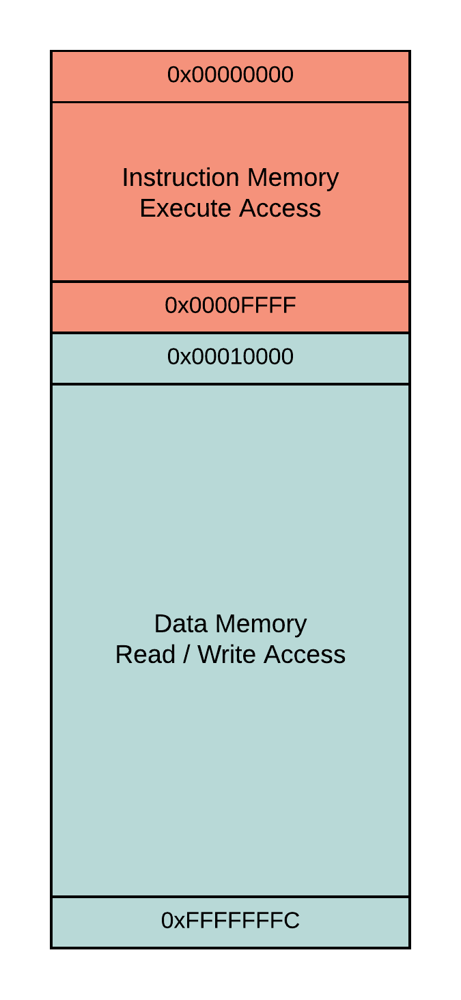

ARM汇编测试，代码流程

1.初始化代码（已经给出）

2.延时代码

在网上找了半天的代码模拟软件，终于找到了一款visual，查看其内存分布如下所示：



在指令执行期间，0-0xffff不可读写。其他的感觉不太重要，就没有详细了解

```
		MOV		R0,#0x80000
		MOV		R1,#0
loop
		ADD		R1,R1,#1
		CMP		R0,R1
		BNE		loop
```

3.点灯代码

```
		LDR		R0,=0x1F02C04
		LDR		R1,=0x7177
		STR		R1,[R0]
		LDR		R0,=0x1F02C10
		LDR		R1,=0x400
		STR		R1,[R0]
```

4.综合代码

现象成功显示出来
